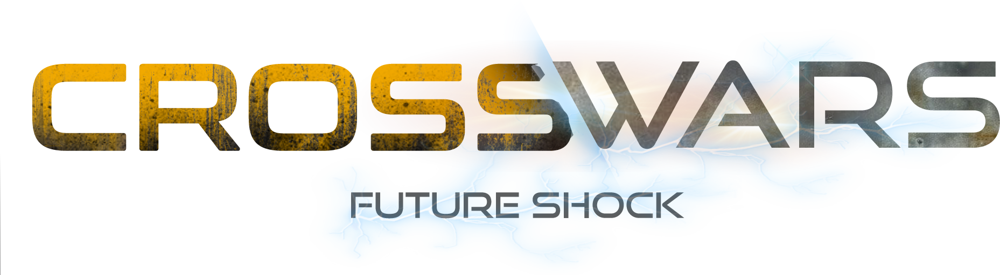

# Home

Welcome to the CrossWars game documentation website.

[Click here to access through the official web app](https://crosswars.io/#/). 

## What is CrossWars?
CrossWars is a massively multiplayer strategy play-to-earn game based on blockchain.

## Why Arbitrum Network?

Arbitrum is, to this day, the most well-built and user-friendly platform for Ethereum. It provides a variety of solutions for Arbitrum’s pain points such as scalability, high gas fee, and infrastructure development while maintaining a high level of security. Arbitrum is specially tailored for mass adoption which is exactly what gaming in the blockchain is going towards. 
