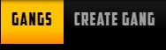
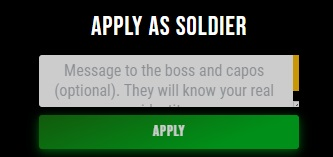
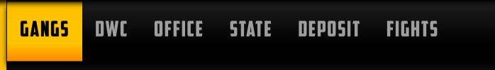

# Gangs

When you are in the Gang tab, all the gangs are listed in the main frame so you can scroll through them and read their descriptions. If a player chooses, he can create or join an existing gang. To learn all about gangs, read about it here: GANGS. When you click on Gangs in the left menu, there are two possible main frames that may appear. If you are not yet a part of any gang, you will see the following upper menu above the main frame:

## Joining a Gang

You can apply to join a gang by simply clicking on their name in the gang list. Once done, the application page of that gang with their info and the input space for you to write a message to them. That writing is optional but highly recommended. When you are done, click on the apply button.

## Create a Gang

If you want to create your own gang, click on the Create Gang tab. It will open the following in the main screen if you do not have enough resources:

If you do have the necessary resources, all you need to do is add a name and description before you click on CREATE and your new gang will be ready.

## Being a Gang Member

Once you become a gang member, every time you click on Gangs in the left menu, the main frame will have the following upper menu:

By clicking on various parts in that menu, you will be diverted to different gang related material. Only the Gangs page will look the same as it would if you were not in the gang. My gang will list you all the gang members, Buildings will show you gang buildings and options to donate your resources to them, Diplomacy will get you options to declare wars or alliances and in Deposit, you can see which gang member has donated how much to each gang building. To get information about how gang buildings function and what are their benefits, click here: Gang buildings

## Gang Roles

Within a Gang, there are roles of which you are assigned. The lead is the Boss. After the Boss, there is Capo. A Capo is assigned by the Boss. Capo has a none-to-many relationship to the Gang, meaning there can be no Capo, or many Capo, at the discretion of the Boss.
